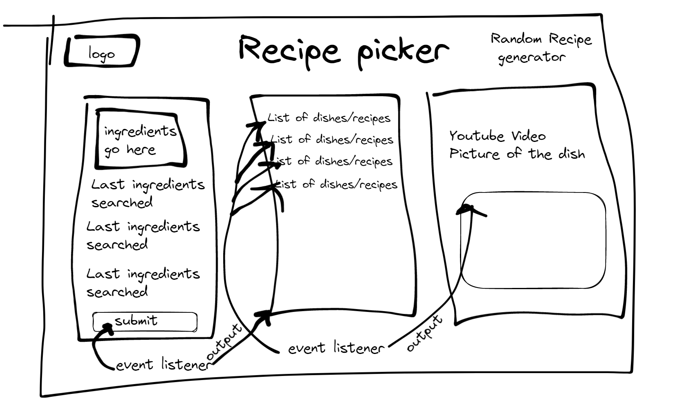

# Recipe Picker

 Recipe Picker helps you find recipes based on ingredients or dishes you have in mind, utilizing a cominbation of HTML, CSS, and Javascript.
  
## Construction Of The Site
### Wire Frame
  
## Getting Recipes 
  Via user input, we call a recipe API from API Ninja and display them to you. After clicking on one of the recipes, a suppliemtnal youtube video will appear. Hopefully the combination of the written recipe and video will assist you in cooking a great meal, or getting inspiration for your own recipe.
  
## Recipe Picker In Action

  
  
# Links
## Deployed Website
 [Click here to try it out!](https://alberdaniel1.github.io/Project1/)

 ## Stuff We Used
 [API Ninjas](https://api-ninjas.com/)

 [Google API](https://developers.google.com/apis-explorer)
 
 [jQuery](https://jquery.com/)
